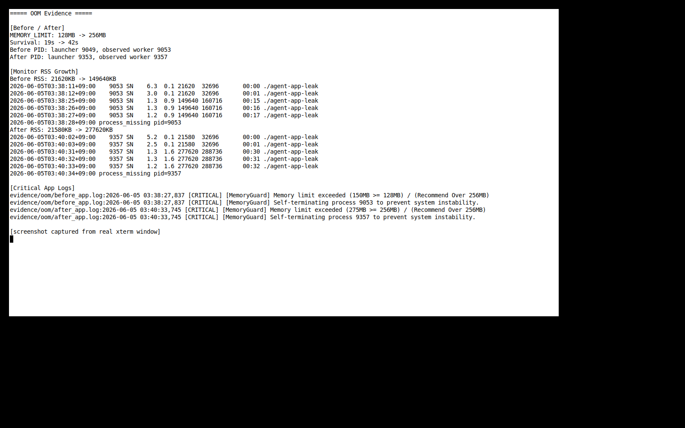

[Bug] OOM - MemoryWorker heap growth triggers MemoryGuard self-termination

## 1. Description (현상 설명)
- `MEMORY_LIMIT=128` 조건에서 `agent-app-leak` worker PID `9053`의 메모리 사용량이 시간에 따라 증가했고, 제한을 넘자 프로세스가 자체 종료되었다.
- 같은 조건에서 `MEMORY_LIMIT=256`으로 올리면 동일한 메모리 증가 패턴은 유지되지만 생존 시간이 19초에서 42초로 늘어났다.
- 실행 조건은 `CPU_MAX_OCCUPY=100`, `MULTI_THREAD_ENABLE=false`, `AGENT_PORT=15034`였다.

## 2. Evidence & Logs (증거 자료)
Screenshot:



- 파일:
  - `evidence/oom/before_app.log`
  - `evidence/oom/before_monitor.log`
  - `evidence/oom/before_ps_top.log`
  - `evidence/oom/after_app.log`
  - `evidence/oom/after_monitor.log`
  - `evidence/oom/after_ps_top.log`

Before PID:

```text
launcher_pid=9049
observed_pid=9053
observed_duration_seconds=19
```

Before monitor excerpt:

```text
2026-06-05T03:38:11+09:00    9053 SN    6.3  0.1 21620  32696       00:00 ./agent-app-leak
2026-06-05T03:38:16+09:00    9053 SN    2.3  0.4 72828  83904       00:06 ./agent-app-leak
2026-06-05T03:38:22+09:00    9053 SN    1.4  0.7 124036 135112      00:12 ./agent-app-leak
2026-06-05T03:38:25+09:00    9053 SN    1.3  0.9 149640 160716      00:15 ./agent-app-leak
2026-06-05T03:38:28+09:00 process_missing pid=9053
```

Before app log:

```text
2026-06-05 03:38:12,682 [INFO] [MemoryWorker] Current Heap: 25MB
2026-06-05 03:38:24,797 [INFO] [MemoryWorker] Current Heap: 125MB
2026-06-05 03:38:27,837 [INFO] [MemoryWorker] Current Heap: 150MB
2026-06-05 03:38:27,837 [CRITICAL] [MemoryGuard] Memory limit exceeded (150MB >= 128MB) / (Recommend Over 256MB)
2026-06-05 03:38:27,837 [CRITICAL] [MemoryGuard] Self-terminating process 9053 to prevent system instability.
```

After PID:

```text
launcher_pid=9353
observed_pid=9357
observed_duration_seconds=42
```

After monitor excerpt:

```text
2026-06-05T03:40:02+09:00    9357 SN    5.2  0.1 21580  32696       00:00 ./agent-app-leak
2026-06-05T03:40:13+09:00    9357 SN    1.5  0.7 123996 135112      00:12 ./agent-app-leak
2026-06-05T03:40:22+09:00    9357 SN    1.4  1.2 200808 211924      00:21 ./agent-app-leak
2026-06-05T03:40:31+09:00    9357 SN    1.3  1.6 277620 288736      00:30 ./agent-app-leak
2026-06-05T03:40:34+09:00 process_missing pid=9357
```

After app log:

```text
2026-06-05 03:40:30,713 [INFO] [MemoryWorker] Current Heap: 250MB
2026-06-05 03:40:33,745 [INFO] [MemoryWorker] Current Heap: 275MB
2026-06-05 03:40:33,745 [CRITICAL] [MemoryGuard] Memory limit exceeded (275MB >= 256MB) / (Recommend Over 256MB)
2026-06-05 03:40:33,745 [CRITICAL] [MemoryGuard] Self-terminating process 9357 to prevent system instability.
```

Before & After:

| Case | MEMORY_LIMIT | PID | Result | Survival |
| --- | ---: | ---: | --- | ---: |
| Before | 128MB | 9053 | MemoryGuard self-termination | 19s |
| After | 256MB | 9357 | MemoryGuard self-termination delayed | 42s |

## 3. Root Cause Analysis (원인 분석)
- `MemoryWorker`가 주기적으로 heap을 늘리고, 실제 RSS도 함께 증가했다.
- Linux에서 프로세스 RSS가 계속 증가하면 전체 시스템 메모리를 압박할 수 있다.
- 이 앱은 OS OOM Killer가 개입하기 전에 자체 `MemoryGuard` 기준으로 메모리 사용량을 검사하고, 제한을 초과하면 자기 자신을 종료한다.
- `MEMORY_LIMIT`를 올렸을 때 종료 시점이 늦어진 것은 메모리 증가 속도는 비슷하지만 허용 상한이 커졌기 때문이다.

## 4. Workaround & Verification (조치 및 검증)
- 임시 조치: `MEMORY_LIMIT=128`에서 `MEMORY_LIMIT=256`으로 증가시켰다.
- 검증 결과: 생존 시간이 19초에서 42초로 늘어났다.
- `MEMORY_LIMIT=512`도 시도했지만 앱이 CPU Worker 경로로 전환되어 OOM 비교에는 `256`이 더 적합했다.
- 근본 조치 제안: 누수 객체 해제, 캐시 크기 제한, 주기적 메모리 관찰, 큰 객체 수명 관리가 필요하다.
