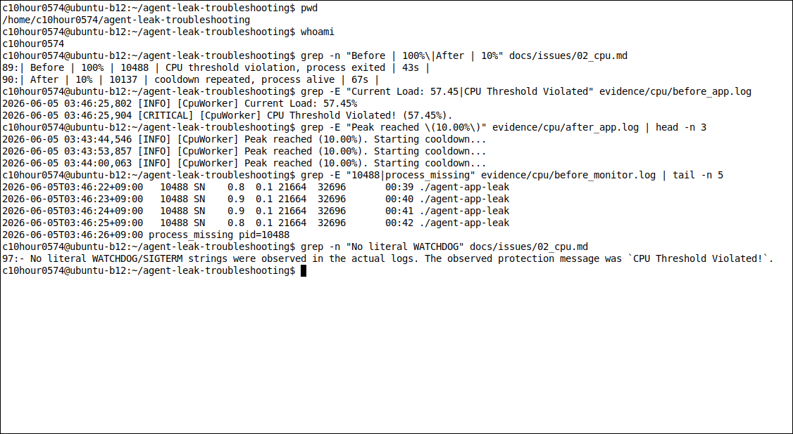
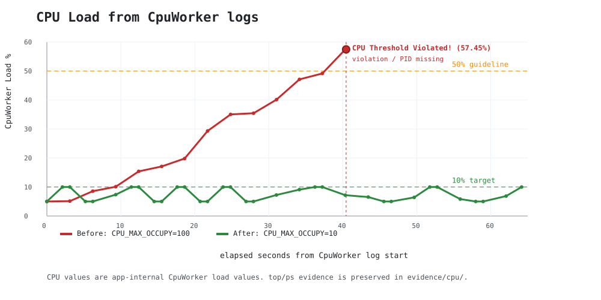

[Bug] CPU Spike - CpuWorker load exceeds protection threshold and process terminates

## 1. Description (현상 설명)
- `CPU_MAX_OCCUPY=100` 조건에서 `CpuWorker` load가 57.45%까지 증가했고, `CPU Threshold Violated!` 로그 직후 프로세스가 종료되었다.
- 같은 `MEMORY_LIMIT=512`, `MULTI_THREAD_ENABLE=false` 조건에서 `CPU_MAX_OCCUPY=10`으로 낮추면 프로세스가 관찰 시간 동안 살아 있었고, CPU load가 10% 근처에서 cooldown을 반복했다.
- 실제 앱 동작은 과제 권장 예시와 달리 `CPU_MAX_OCCUPY`를 높게 둔 경우에 장애가 재현되었다. 따라서 보고서는 실제 관측값을 기준으로 작성했다.

## 2. Evidence & Logs (증거 자료)
Screenshot:



Graph:



CPU 그래프는 앱 로그의 `CpuWorker` load 값만 사용했다. `57.45%` threshold 초과와 `10.00%` cooldown 반복을 원본 값 그대로 표시한다.

- 파일:
  - `evidence/cpu/before_app.log`
  - `evidence/cpu/before_monitor.log`
  - `evidence/cpu/before_ps_top.log`
  - `evidence/cpu/before_top_fast.log`
  - `evidence/cpu/before_threads.log`
  - `evidence/cpu/after_app.log`
  - `evidence/cpu/after_monitor.log`
  - `evidence/cpu/after_ps_top.log`

Before PID:

```text
launcher_pid=10484
observed_pid=10488
observed_duration_seconds=43
```

Before app log:

```text
2026-06-05 03:45:45,449 [INFO] [CpuWorker] Started. Maximum CPU Limit: 100%
2026-06-05 03:46:07,179 [INFO] [CpuWorker] Current Load: 29.31%
2026-06-05 03:46:16,493 [INFO] [CpuWorker] Current Load: 40.14%
2026-06-05 03:46:22,698 [INFO] [CpuWorker] Current Load: 49.15%
2026-06-05 03:46:25,802 [INFO] [CpuWorker] Current Load: 57.45%
2026-06-05 03:46:25,904 [CRITICAL] [CpuWorker] CPU Threshold Violated! (57.45%).
```

CPU를 한 프로세스가 오래 점유하면 같은 서버의 다른 작업이 늦게 처리된다. 그래서 앱은 CPU load가 보호 기준을 넘으면 종료해서 시스템 전체 지연을 막는다.

Before top evidence:

```text
top_fast=top -b -d 0.2 -n 220 -p 10488
max sampled OS %CPU: 25.0
10488 c10hour+ 30 10 32696 21664 11868 S 25.0 0.1 0:00.33 agent-a+
```

Before monitor excerpt:

```text
2026-06-05T03:45:45+09:00   10488 SN    5.3  0.1 21664 32696 00:00 ./agent-app-leak
2026-06-05T03:46:16+09:00   10488 SN    1.0  0.1 21664 32696 00:32 ./agent-app-leak
2026-06-05T03:46:25+09:00   10488 SN    1.0  0.1 21664 32696 00:41 ./agent-app-leak
2026-06-05T03:46:26+09:00 process_missing pid=10488
```

After PID:

```text
launcher_pid=10133
observed_pid=10137
observed_duration_seconds=67
process_alive_after_observation=yes
```

After app log:

```text
2026-06-05 03:43:42,444 [INFO] [CpuWorker] Started. Maximum CPU Limit: 10%
2026-06-05 03:43:44,546 [INFO] [CpuWorker] Peak reached (10.00%). Starting cooldown...
2026-06-05 03:43:47,649 [INFO] [CpuWorker] Cooldown complete (5.00%). Resuming load increase...
2026-06-05 03:44:46,625 [INFO] [CpuWorker] Peak reached (10.00%). Starting cooldown...
```

Before & After:

| Case | CPU_MAX_OCCUPY | PID | Result | Observation |
| --- | ---: | ---: | --- | ---: |
| Before | 100% | 10488 | CPU threshold violation, process exited | 43s |
| After | 10% | 10137 | cooldown repeated, process alive | 67s |

## 3. Root Cause Analysis (원인 분석)
- `CPU_MAX_OCCUPY=100`은 앱 로그에서 `Recommend Under 50%` 경고가 표시되는 설정이다.
- `CpuWorker`가 load를 계속 올리다가 내부 보호 기준을 넘었고, 앱은 시스템 응답성 저하를 막기 위해 프로세스를 종료했다.
- `top` 고빈도 샘플에서는 OS 관점 `%CPU`가 최대 25.0%로 잡혔다. 앱 내부 load 57.45%와 OS 샘플 값이 완전히 같지는 않지만, 짧은 burst 또는 앱 내부 계산 기준 차이로 볼 수 있다.
- 리터럴 `WATCHDOG` 또는 `SIGTERM` 문자열은 이번 로그에서 관측되지 않았다. 대신 보호 종료 근거는 `[CRITICAL] [CpuWorker] CPU Threshold Violated!` 메시지와 직후 PID 소멸이다.
- No literal WATCHDOG/SIGTERM strings were observed in the actual logs. The observed protection message was `CPU Threshold Violated!`.

## 4. Workaround & Verification (조치 및 검증)
- 임시 조치: `CPU_MAX_OCCUPY=100`에서 `CPU_MAX_OCCUPY=10`으로 낮췄다.
- 검증 결과: Before는 43초에 종료되었고, After는 67초 관찰 후에도 살아 있었다.
- After 로그는 `Peak reached (10.00%). Starting cooldown...`와 `Cooldown complete`를 반복했다.
- 근본 조치 제안: 무한 루프 제거, sleep/backoff 추가, 작업 큐 제한, CPU bound 작업 분리, CPU 사용량 측정 기준 명확화가 필요하다.
