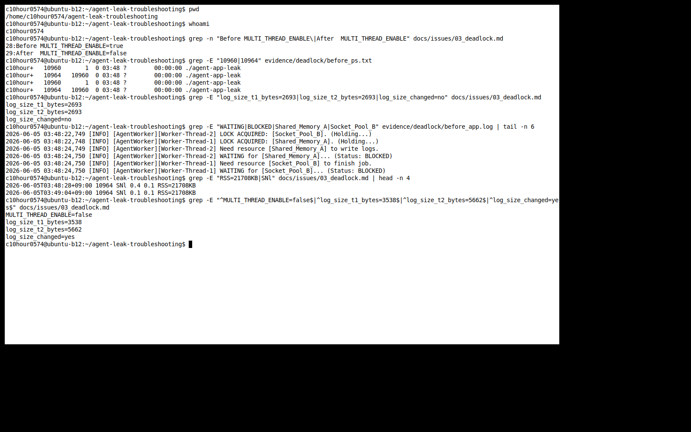

[Bug] Deadlock - Two worker threads wait on each other's locks and stop progress

## 1. Description (현상 설명)
- `MULTI_THREAD_ENABLE=true` 조건에서 worker PID `10964`는 살아 있었지만 로그가 `WAITING` / `BLOCKED` 지점에서 멈췄다.
- 같은 `MEMORY_LIMIT=512`, `CPU_MAX_OCCUPY=10` 조건에서 `MULTI_THREAD_ENABLE=false`로 바꾸면 로그가 계속 갱신되고 순차 작업이 완료되어 데드락이 회피되었다.
- Deadlock만 분리하기 위해 CPU 보호 종료가 먼저 발생하는 `CPU_MAX_OCCUPY=100` 대신 `10`을 사용했다.
- Deadlock은 두 작업이 서로 필요한 자원을 잡고 놓지 않아 아무도 앞으로 진행하지 못하는 상태다.

## 2. Evidence & Logs (증거 자료)
Screenshot:



- 파일:
  - `evidence/deadlock/before_app.log`
  - `evidence/deadlock/before_monitor.log`
  - `evidence/deadlock/before_ps.txt`
  - `evidence/deadlock/before_threads.txt`
  - `evidence/deadlock/before_top_h.txt`
  - `evidence/deadlock/after_app.log`
  - `evidence/deadlock/after_monitor.log`
  - `evidence/deadlock/after_ps.txt`
  - `evidence/deadlock/after_threads.txt`

Configuration:

```text
Before MULTI_THREAD_ENABLE=true
After  MULTI_THREAD_ENABLE=false
```

Before PID:

```text
launcher_pid=10960
observed_pid=10964
process_alive_after_observation=yes
observed_duration_seconds=56
```

PID existence:

```text
2026-06-05T03:48:28+09:00
c10hour+   10960       1  0 03:48 ? 00:00:00 ./agent-app-leak
c10hour+   10964   10960  0 03:48 ? 00:00:00 ./agent-app-leak

2026-06-05T03:49:04+09:00
c10hour+   10960       1  0 03:48 ? 00:00:00 ./agent-app-leak
c10hour+   10964   10960  0 03:48 ? 00:00:00 ./agent-app-leak
```

Log stopped:

```text
log_size_t1_bytes=2693
log_size_t2_bytes=2693
log_size_changed=no
last_log_t1=2026-06-05 03:48:24,750 [INFO] [AgentWorker][Worker-Thread-1] WAITING for [Socket_Pool_B]... (Status: BLOCKED)
last_log_t2=2026-06-05 03:48:24,750 [INFO] [AgentWorker][Worker-Thread-1] WAITING for [Socket_Pool_B]... (Status: BLOCKED)
```

Before app log:

```text
2026-06-05 03:48:22,749 [INFO] [AgentWorker][Worker-Thread-2] LOCK ACQUIRED: [Socket_Pool_B]. (Holding...)
2026-06-05 03:48:22,748 [INFO] [AgentWorker][Worker-Thread-1] LOCK ACQUIRED: [Shared_Memory_A]. (Holding...)
2026-06-05 03:48:24,749 [INFO] [AgentWorker][Worker-Thread-2] Need resource [Shared_Memory_A] to write logs.
2026-06-05 03:48:24,750 [INFO] [AgentWorker][Worker-Thread-2] WAITING for [Shared_Memory_A]... (Status: BLOCKED)
2026-06-05 03:48:24,750 [INFO] [AgentWorker][Worker-Thread-1] Need resource [Socket_Pool_B] to finish job.
2026-06-05 03:48:24,750 [INFO] [AgentWorker][Worker-Thread-1] WAITING for [Socket_Pool_B]... (Status: BLOCKED)
```

CPU/MEM stagnation:

```text
2026-06-05T03:48:28+09:00 10964 SNl 0.4 0.1 RSS=21708KB
2026-06-05T03:49:04+09:00 10964 SNl 0.1 0.1 RSS=21708KB
```

Thread evidence:

```text
PID 10964 had three threads.
Main thread CPU fell from 0.4% to 0.1%.
Worker thread CPU stayed 0.0%.
```

After comparison:

```text
MULTI_THREAD_ENABLE=false
launcher_pid=11158
observed_pid=11162
process_alive_after_observation=yes
log_size_t1_bytes=3538
log_size_t2_bytes=5662
log_size_changed=yes
```

After app log:

```text
2026-06-05 03:49:44,154 [INFO] [Thread-A] Task Completed. (100%)
2026-06-05 03:49:44,411 [INFO] [Thread-B] Task Completed. (100%)
2026-06-05 03:49:44,667 [INFO] [Thread-C] Task Completed. (100%)
2026-06-05 03:49:44,719 [INFO] [Scheduler] All tasks completed.
2026-06-05 03:50:36,392 [INFO] [MemoryWorker] Current Heap: 450MB
```

## 3. Root Cause Analysis (원인 분석)
- Worker-Thread-1은 `Shared_Memory_A`를 획득한 뒤 `Socket_Pool_B`를 기다렸다.
- Worker-Thread-2는 `Socket_Pool_B`를 획득한 뒤 `Shared_Memory_A`를 기다렸다.
- 두 스레드가 서로의 자원을 기다리므로 A to B, B to A 형태의 순환 대기가 생겼다.
- 이 상황은 데드락의 조건 중 상호 배제, 점유 대기, 비선점, 순환 대기가 동시에 만족된 것으로 볼 수 있다.
- PID는 살아 있지만 CPU/MEM 변화가 거의 없고 로그가 멈췄기 때문에 정상 진행이 아니라 대기 상태로 판단했다.
- 프로세스가 살아있다는 것은 종료되지 않았다는 뜻일 뿐, 일을 계속하고 있다는 뜻은 아니다. 로그가 멈추고 CPU/MEM 변화가 없으면 살아 있지만 멈춘 상태로 볼 수 있다.

## 4. Workaround & Verification (조치 및 검증)
- 임시 조치: `MULTI_THREAD_ENABLE=true`에서 `MULTI_THREAD_ENABLE=false`로 변경했다.
- 검증 결과: true 조건에서는 로그 크기가 2693 bytes에서 멈췄고, false 조건에서는 3538 bytes에서 5662 bytes로 증가했다.
- false 조건에서는 Thread-A/B/C가 순차 완료되고 이후 worker 로그가 계속 갱신되었다.
- 근본 조치 제안: lock 획득 순서 통일, timeout lock, try-lock, critical section 축소, lock 범위 문서화가 필요하다.
